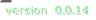
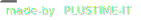

# V3 Recaptcha for Vue3

<div style="text-align:center">


[](LICENSE)
[](https://plustime.com.au)

</div>

## About

This package is used to incorporate Googles V3 Recaptcha into a vue project easily. It handles:

- Injecting script into head to load googles recaptcha.
- Generating a token to be verified on your server.
- Pass actions to recaptcha token generator
- Handle recaptcha loading dynamically if required.

## Installation

```bash
npm install v3-recaptcha

```

## Usage

Import the package in the component you want to use recaptcha.

```js
import { useV3Recaptcha } from "v3-recaptcha";
```

Pull the required functions:

```js
const { recaptchaIsLoaded, hasRecaptcha, loadRecaptcha, getToken } = useV3Recaptcha("YOUR SITE KEY HERE");
```

`"YOUR SITE KEY HERE"` should be replaced with your site key from google. If you are adding this into a package and allowing users choose if they want to include recaptcha, this can be replaced with `null` and recaptcha wont load, getToken will then return `undefined` instead of a token string.

Get a token:

```js
const token = await getToken(`process_form`);
```

## Functions and Variables

| Variables         |       Type        | Description                                                                             |
| :---------------- | :---------------: | :-------------------------------------------------------------------------------------- |
| recaptchaIsLoaded |   ref<boolean>    | Returns whether the recaptcha script has loaded.                                        |
| hasRecaptcha      | computed<boolean> | Returns whether the site key has been loaded                                            |
| loadRecaptcha     |     function      | Loads the recaptcha script, will be skipped if site key is `null ` OR is already loaded |
| getToken          |  async function   | Returns either a string if site key is set, or `undefined` if site key is `null`        |
